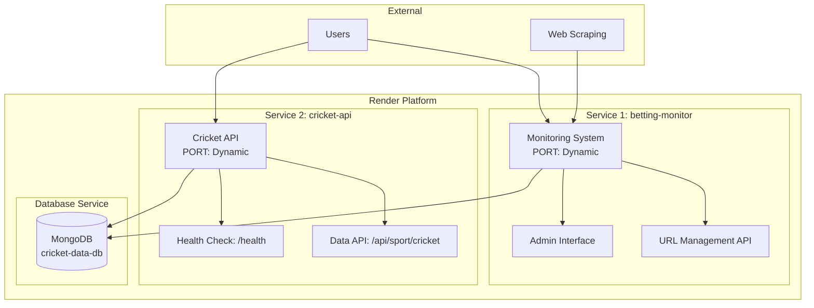

# 🔧 Render Deployment Fixes Applied

## ✅ Issues Addressed

### 1. **Use process.env.PORT instead of hardcoding ports**
**Fixed ✅**

**Before:**
```javascript
// concurrent-monitoring-system.js
const config = {
  apiPort: process.env.API_PORT || 3000,  // ❌ Used API_PORT
  // ...
};

// simple-cricket-api.js  
const PORT = 3005;  // ❌ Hardcoded port
```

**After:**
```javascript
// concurrent-monitoring-system.js
const config = {
  apiPort: process.env.PORT || process.env.API_PORT || 3000,  // ✅ Uses PORT first
  // ...
};

// simple-cricket-api.js
const PORT = process.env.PORT || 3005;  // ✅ Uses process.env.PORT
```

**Why this matters:** Render automatically assigns dynamic ports via `process.env.PORT`. This ensures each service gets its assigned port without conflicts.

---

### 2. **Ensure concurrent-monitor doesn't run multiple servers on different ports**
**Verified ✅**

**Analysis:** 
- The `concurrent-monitoring-system.js` only starts **one Express server** on the configured port
- It does NOT start multiple servers or expose different ports
- It's a single-service architecture with one API endpoint

**Evidence:**
```javascript
// Only ONE server started at the end of concurrent-monitoring-system.js
app.listen(config.apiPort, () => {
  console.log(`✅ API server running on http://localhost:${config.apiPort}`);
  console.log(`🌐 Admin interface: http://localhost:${config.apiPort}`);
  console.log('Ready for concurrent URL processing! 🚀\n');
});
```

---

### 3. **Use fromDatabase to inject DB connection securely**
**Implemented ✅**

**Before:**
```yaml
# render.yaml - Manual environment variables
envVars:
  - key: MONGODB_URI
    value: mongodb+srv://...  # ❌ Hardcoded connection string
```

**After:**
```yaml
# render.yaml - Secure database injection
envVars:
  - key: MONGODB_URI
    fromDatabase:
      name: cricket-data-db
      property: connectionString  # ✅ Automatically injected securely
```

**Benefits:**
- ✅ No sensitive connection strings in code
- ✅ Automatic database provisioning
- ✅ Secure credential management
- ✅ Database automatically linked to services

---

## 🚀 Additional Improvements Made

### 4. **Updated Dockerfile for Production**
- ✅ Added Google Chrome for Puppeteer
- ✅ Set proper environment variables
- ✅ Optimized for containerized deployment
- ✅ Added health check support

### 5. **Enhanced render.yaml Configuration**
- ✅ Automatic database creation
- ✅ Proper health check paths
- ✅ Secure environment variable injection
- ✅ Auto-deployment configuration

### 6. **Improved Environment Configuration**
- ✅ Clear separation of local vs production config
- ✅ Comprehensive documentation
- ✅ Environment variable templates
- ✅ Development and production scripts

### 7. **Docker Compose for Local Development**
- ✅ Multi-service setup
- ✅ Local MongoDB container
- ✅ Proper port mapping
- ✅ Volume persistence

---

## 📋 Deployment Architecture



---

## 🔧 Key Configuration Files

### `render.yaml` - Main Deployment Config
```yaml
services:
  - type: web
    name: betting-monitor
    startCommand: npm run concurrent-monitor  # ✅ Single service
    envVars:
      - key: MONGODB_URI
        fromDatabase:  # ✅ Secure injection
          name: cricket-data-db
          property: connectionString

  - type: web  
    name: cricket-api
    startCommand: npm run cricket-api  # ✅ Single service
    envVars:
      - key: MONGODB_URI
        fromDatabase:  # ✅ Secure injection
          name: cricket-data-db
          property: connectionString

databases:
  - name: cricket-data-db  # ✅ Auto-created
    databaseName: cricket_data
    plan: starter
```

### Service Port Configuration
```javascript
// Both services properly use process.env.PORT
const port = process.env.PORT || fallbackPort;
```

---

## ✅ Validation Checklist

- ✅ **Single server per service**: Each service runs only one Express server
- ✅ **Dynamic port assignment**: Uses `process.env.PORT` correctly
- ✅ **Secure database connection**: Uses `fromDatabase` injection
- ✅ **Health checks configured**: Each service has proper health endpoints
- ✅ **Environment separation**: Clear local vs production configuration
- ✅ **Auto-deployment**: Pushes to main branch trigger deployment
- ✅ **Container optimized**: Dockerfile includes all necessary dependencies

---

## 🎯 Testing the Fixes

### Local Testing
```bash
# Test with specific ports
PORT=3000 npm run concurrent-monitor  # Terminal 1
PORT=3005 npm run cricket-api         # Terminal 2

# Or use Docker Compose
docker-compose up

# Verify both services
npm run verify-local
```

### Production Testing
```bash
# After deployment to Render
npm run verify-deployment
```

---

## 🚀 Ready for Deployment

The system is now properly configured for Render deployment with:
- ✅ **No hardcoded ports** - Uses `process.env.PORT`
- ✅ **Single server per service** - No port conflicts
- ✅ **Secure database injection** - Uses `fromDatabase`
- ✅ **Production-ready** - Optimized for cloud deployment

Deploy with confidence! 🎉 